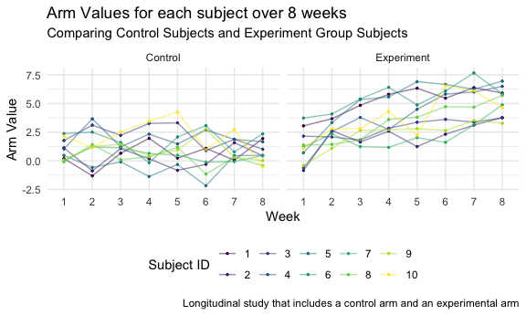

p8105\_hw5\_tk2886
================
Tanvir Khan
11/13/2021

# Problem 1

``` r
homicide_data <-
  read_csv(file = "./homicide-data.csv")
```

    ## Rows: 52179 Columns: 12

    ## ── Column specification ────────────────────────────────────────────────────────
    ## Delimiter: ","
    ## chr (9): uid, victim_last, victim_first, victim_race, victim_age, victim_sex...
    ## dbl (3): reported_date, lat, lon

    ## 
    ## ℹ Use `spec()` to retrieve the full column specification for this data.
    ## ℹ Specify the column types or set `show_col_types = FALSE` to quiet this message.

``` r
n_row = homicide_data %>% nrow()
n_col = homicide_data %>% ncol()
key_var = homicide_data %>% names()
```

**Analysis:** Based on the raw data, there is 52,179 observations of
homicide cases in the 50 large U.S. cities. The data includes the
location of the killing, basic demographic information about each
victim, the status of the case, reported date of the homicide, and the
case id (uid). The *number of rows* in the raw homicide data that was
provided is **52179**. The *number of columns* in the raw homicide data
that was provided is **12**. They key variables in this raw data set
are: **uid, reported\_date, victim\_last, victim\_first, victim\_race,
victim\_age, victim\_sex, city, state, lat, lon, disposition**.

## Code was provided by professor on 11/15/2021

``` r
homicide_clean_data <-
  homicide_data %>%
  mutate(city_state = str_c(city, state),
         resolution = case_when(
          disposition == "Closed without arrest" ~ "unsolved",
         disposition == "Open/No arrest" ~ "unsolved",
         disposition == "Closed by arrest" ~ "solved"
         ))  %>%
  relocate(city_state) %>%
  filter(city_state != "TulsaAL")


baltimore_df <-  
  homicide_clean_data %>%
  filter(city_state == "BaltimoreMD")

baltimore_summary <-
  baltimore_df %>% 
  summarise(
    unsolved = sum(resolution == "unsolved"),
    n = n()
  )

baltimore_test <-
  prop.test(
  x = baltimore_summary %>% pull(unsolved),
  n = baltimore_summary %>% pull(n)
  )

baltimore_test %>% 
  broom::tidy()
```

    ## # A tibble: 1 × 8
    ##   estimate statistic  p.value parameter conf.low conf.high method    alternative
    ##      <dbl>     <dbl>    <dbl>     <int>    <dbl>     <dbl> <chr>     <chr>      
    ## 1    0.646      239. 6.46e-54         1    0.628     0.663 1-sample… two.sided

``` r
prop_test_fucntion <- function(city_df) {
  
  city_summary =
  city_df %>% 
  summarise(
    unsolved = sum(resolution == "unsolved"),
    n = n()
  )
  
  city_test =
  prop.test(
  x = city_summary %>% pull(unsolved),
  n = city_summary %>% pull(n)
  )
  
  
  return(city_test)
}


nested_df <-
  homicide_clean_data %>% 
  nest(data = uid:resolution) %>%
  mutate(
    test_results = map(data, prop_test_fucntion),
    tidy_results = map(test_results, broom::tidy)
  ) %>%
  select(city_state, tidy_results) %>%
  unnest(tidy_results) %>%
  select(city_state, estimate, starts_with("conf"))

nested_df %>% 
  mutate(city_state = fct_reorder(city_state, estimate)) %>%
  ggplot(aes(x = city_state, y = estimate)) +
  geom_point() +
  geom_errorbar(aes(ymin = conf.low, ymax = conf.high)) +
  theme(axis.text.x = element_text(angle = 90, vjust = 0.5, hjust = 1))
```


# Problem 2

### Using the list.files function to gather all file names in the specified directory and then putting all the files in a tibble.

``` r
file_name_list = list.files("./data")


study_df <- tibble(files = file_name_list)
```

### Creating a function in which the files are passed in.

``` r
csv_iteration = 
  function(data_files) {
  participant_data = 
    read_csv(file = paste0("./data/", data_files)) %>% 
    mutate(experiment_group = data_files)
  }
```

### Merging all the file data

``` r
merging_data = 
  map_df(study_df, csv_iteration) 
```

### Tidying the data

``` r
arm_dfc <-
  merging_data %>%
  janitor::clean_names() %>%
  gather(key = week, value = arm_val, week_1:week_8) %>%
  separate(experiment_group, into = c("experiment_group", "subject_id"), sep = "_") %>%
  mutate(experiment_group = recode(experiment_group, 
                    "con" = "Control",
                    "exp" = "Experiment")) %>%
  mutate(week = str_remove(week, "week_")) %>%
  mutate(week = as.integer(week)) %>%
  mutate(subject_id = str_remove(subject_id, ".csv")) %>% 
  mutate(subject_id = as.integer(subject_id)) %>%
  mutate(across(.cols = c(experiment_group, subject_id, week), as.factor)) %>%
  select(experiment_group, subject_id, arm_val, week)

arm_dfc
```

    ## # A tibble: 160 × 4
    ##    experiment_group subject_id arm_val week 
    ##    <fct>            <fct>        <dbl> <fct>
    ##  1 Control          1             0.2  1    
    ##  2 Control          2             1.13 1    
    ##  3 Control          3             1.77 1    
    ##  4 Control          4             1.04 1    
    ##  5 Control          5             0.47 1    
    ##  6 Control          6             2.37 1    
    ##  7 Control          7             0.03 1    
    ##  8 Control          8            -0.08 1    
    ##  9 Control          9             0.08 1    
    ## 10 Control          10            2.14 1    
    ## # … with 150 more rows

### Creating the Spaghetti Plot and seperating by control and experiment group

``` r
arm_dfc %>%
  ggplot(aes(x = week, y = arm_val, color = subject_id)) + 
  geom_point(size = .5) + 
  geom_line(aes(group = subject_id),  alpha = .5) + 
  facet_grid(~experiment_group) +
  labs(
    title = "Arm Values for each subject over 8 weeks",
    subtitle = "Comparing Control Subjects and Experiment Group Subjects", 
    x = "Week", 
    y = "Arm Value",
    caption = "Longitudinal study that includes a control arm and an experimental arm") +
  viridis::scale_color_viridis(
    name = "Subject ID", 
    discrete = TRUE
  )
```



Analysis of plot: The arm value for experiment group subjects have an
upward trend from week 1 to week 8. It is important to state in some
weeks the arm value decreases for specific subjects in the experiment
group but when comparing week 1 to week 8, the arm value is overall
upward trend for all subjects. The arm value for control group for each
subject fluctuates from week 1 to week 8. There seems to be no specific
trends or patterns for the control group because sometimes the arm value
will increase for one week and then another week the arm value will
decrease and then increase again. Also, there is not a significant
change in arm value for each subject in the control group from week 1
versus week 8.

# Problem 3

## The first part of the code was provided by professor

``` r
set.seed(10)

iris_with_missing = iris %>% 
  map_df(~replace(.x, sample(1:150, 20), NA)) %>%
  mutate(Species = as.character(Species))

iris_with_missing
```

    ## # A tibble: 150 × 5
    ##    Sepal.Length Sepal.Width Petal.Length Petal.Width Species
    ##           <dbl>       <dbl>        <dbl>       <dbl> <chr>  
    ##  1          5.1         3.5          1.4         0.2 setosa 
    ##  2          4.9         3            1.4         0.2 setosa 
    ##  3          4.7         3.2          1.3         0.2 setosa 
    ##  4          4.6         3.1          1.5        NA   setosa 
    ##  5          5           3.6          1.4         0.2 setosa 
    ##  6          5.4         3.9          1.7         0.4 setosa 
    ##  7         NA           3.4          1.4         0.3 setosa 
    ##  8          5           3.4          1.5         0.2 setosa 
    ##  9          4.4         2.9          1.4         0.2 setosa 
    ## 10          4.9         3.1         NA           0.1 setosa 
    ## # … with 140 more rows

## Creating a function called iris\_function

``` r
iris_function = function(x) {
  if (!is.numeric(x) & !is.character(x)) {
    stop("Argument should be numeric or character")
 } else if (is.numeric(x)) {
   replace_na(x, mean(x, na.rm = TRUE))
 } else if (is.character(x)) {
   replace_na(x, "virginica")
 }}
```

#### Function first checks if the argument that is passed in is a numeric or character and if it is true, then we go to the next conditional statement block or else the function will stop and display an error message.

``` r
iris_values = map_dfr(iris_with_missing, iris_function)
iris_values
```

    ## # A tibble: 150 × 5
    ##    Sepal.Length Sepal.Width Petal.Length Petal.Width Species
    ##           <dbl>       <dbl>        <dbl>       <dbl> <chr>  
    ##  1         5.1          3.5         1.4         0.2  setosa 
    ##  2         4.9          3           1.4         0.2  setosa 
    ##  3         4.7          3.2         1.3         0.2  setosa 
    ##  4         4.6          3.1         1.5         1.19 setosa 
    ##  5         5            3.6         1.4         0.2  setosa 
    ##  6         5.4          3.9         1.7         0.4  setosa 
    ##  7         5.82         3.4         1.4         0.3  setosa 
    ##  8         5            3.4         1.5         0.2  setosa 
    ##  9         4.4          2.9         1.4         0.2  setosa 
    ## 10         4.9          3.1         3.77        0.1  setosa 
    ## # … with 140 more rows

#### I used map\_dfr because this function directly binds the rows when map output is a dataframe or a named vector.
